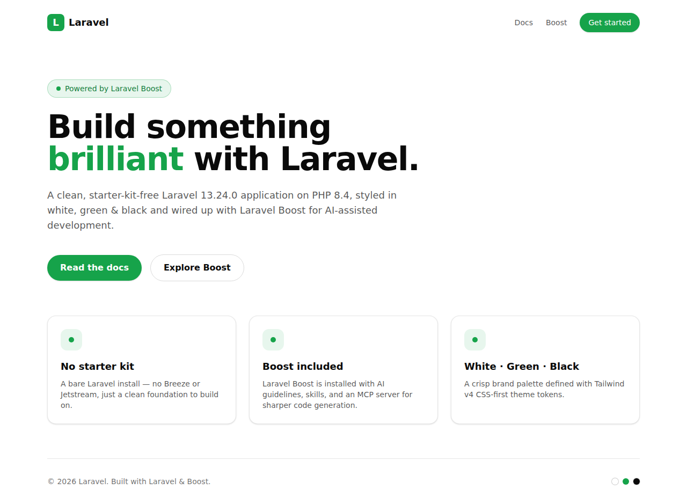

# Laravel + Vue 3 — AI Product Copy Studio

A **Laravel 13 / Vue 3** application built to demonstrate full-stack work end to end:
a queued **AI copy generator** for e-commerce products, plus a hand-rolled auth area
and validated forms — no starter kit, no scaffolding.

**▶ Live demo: [laravel-newapp.onrender.com](https://laravel-newapp.onrender.com/)**
&nbsp;·&nbsp; **Deploy your own:** [DEPLOYMENT.md](DEPLOYMENT.md)



---

## What's here

| Feature | Route | Stack |
| --- | --- | --- |
| **AI Copy Studio** | `/studio` | Vue 3 SPA + Pinia · queued jobs · LLM API |
| Contact form | `/contact` | Blade · Form Request validation · Post/Redirect/Get |
| Session auth | `/login` | Hand-rolled, throttled — no Breeze/Jetstream |
| Admin dashboard | `/admin` | Auth-guarded, paginated submissions |
| REST API | `/api/v1/*` | API resources, form requests, `202 Accepted` + polling |

**37 tests / 115 assertions** covering happy paths, validation failures, auth
guards, and both LLM provider failure modes. CI runs the suite and Pint on every
push.

---

## The AI Copy Studio

Add a product, pick a content type, and an LLM writes the description, ad copy,
title variants, or SEO meta. Generation runs on a queue; the Vue store polls until
it lands.

```
POST /api/v1/products/{id}/generations
        │
        ├─ build the prompt, persist it on the row, return 202 immediately
        │
        └─ GenerateProductContent (queued)
                 └─ LlmClient::complete() ──> Anthropic  |  Fake
                          │
                          └─ result + token usage written back to the row

GET /api/v1/generations/{id}   ← the Pinia store polls this until is_complete
```

Generation takes seconds — too long to hold an HTTP request open — so the endpoint
returns `202 Accepted` with a `queued` row and the client polls. The prompt is
stored **on the row** rather than rebuilt at read time, because prompt templates
change and old output shouldn't be attributed to the current one.

### The provider abstraction

`LlmClient` is a one-method interface with two implementations:

- `AnthropicClient` — the real provider, via the official PHP SDK.
- `FakeLlmClient` — deterministic, free, offline.

The point isn't swappability for its own sake. It's that **every failure path
becomes testable without touching the network** — `FakeLlmClient::failWith()` lets a
test assert what happens on a rate limit versus a refusal, which is otherwise the
hardest part of LLM integration to cover. It also means the whole app runs with no
API key at all.

### Failure handling

Provider calls fail in ways ordinary HTTP calls don't, so `LlmException` carries a
`retryable` flag:

- **Retryable** (429, 5xx, timeout) — rethrown, so the queue retries with backoff.
- **Not retryable** (400, refusal) — recorded and the job stops. Burning two more
  attempts on a request that fails identically only delays the error.

A safety classifier can also decline a request and still return **HTTP 200** with
empty content and `stop_reason: "refusal"`. Reading `content[0]` blindly there
records an empty string as a successful generation, so `AnthropicClient` checks
`stopReason` first — and a test pins that behavior.

`failed()` closes out any row left in `processing` after the final attempt, so the
UI never polls a generation that has silently stopped moving.

---

## Running it

**Prerequisites:** PHP 8.4+, Composer, Node 18+.
On macOS, [Laravel Herd](https://herd.laravel.com) bundles PHP + Composer.

```bash
git clone https://github.com/jrgramsdev/copy-studio.git
cd copy-studio

composer install
npm install
cp .env.example .env
php artisan key:generate
touch database/database.sqlite
php artisan migrate --seed

composer run dev        # server + Vite in one command
php artisan queue:work  # generation runs on the queue
```

Open **http://127.0.0.1:8000** for the landing page, or **/studio** for the copy
generator.

It runs with **no API key** — `LLM_DRIVER` defaults to `fake`, which returns
deterministic copy through the entire pipeline. For real copy:

```env
LLM_DRIVER=anthropic
ANTHROPIC_API_KEY=sk-ant-...
```

### Admin login (demo)

```
Email:    admin@example.com
Password: password
```

Seeded idempotently from `ADMIN_EMAIL` / `ADMIN_PASSWORD` so it survives ephemeral
deploys. Override both for anything real.

---

## API

| Method | Path | Notes |
| --- | --- | --- |
| `GET` | `/api/v1/products` | Paginated, generations eager-loaded |
| `POST` | `/api/v1/products` | `name` required; `source_url`, `notes` optional |
| `GET` | `/api/v1/products/{id}` | |
| `DELETE` | `/api/v1/products/{id}` | Cascades to generations |
| `POST` | `/api/v1/products/{id}/generations` | `type` — returns `202` |
| `GET` | `/api/v1/generations/{id}` | Poll target; `is_complete` drives the client |

Content types: `product_description`, `ad_copy`, `title_variants`, `seo_meta`.

---

## Tech stack

| Area | Choice |
| --- | --- |
| Framework | Laravel 13 (PHP 8.4) |
| Frontend | Vue 3 (`<script setup>`), Pinia, Vue Router, Tailwind v4, Blade |
| Build | Vite |
| Database | SQLite (zero-config; swappable for Postgres/MySQL) |
| Queue | Laravel queues (database driver) |
| LLM | Anthropic (`claude-opus-5`) behind a driver interface |
| Tests | PHPUnit + Pint, run in CI |
| Deploy | Docker + Render blueprint (`render.yaml`) |

### Deployment note

Render's free tier has no separate background-worker service, so the queue worker
runs inside the web container (`docker/entrypoint.sh`) under a restart loop — a
worker that died silently would leave every generation stuck at `queued`. Web and
worker share one SQLite file, so the connection runs in WAL mode with a busy
timeout instead of the default rollback journal, where one writer blocks the other
outright.

## Tests

```bash
php artisan test
```

```
tests/Unit/PromptBuilderTest.php                    prompt assembly
tests/Feature/Api/ProductApiTest.php                CRUD + validation
tests/Feature/Api/GenerationApiTest.php             queueing, polling, bad input
tests/Feature/Jobs/GenerateProductContentTest.php   retryable vs terminal failure
tests/Feature/ContactFormTest.php                   validation + persistence
tests/Feature/AuthAdminTest.php                     login, throttling, auth guards
```

The job tests are the ones worth reading — they cover what happens when the
provider misbehaves, which is where AI-integration code tends to be wrong in ways
that still look like it works.

---

## Notes on the AI-assisted workflow

Built with Claude Code. Two things mattered more than the speed:

- **`CLAUDE.md` sets standards per repo** — conventions, Laravel-specific rules,
  what not to touch. The agent reads it before writing, so generated code matches
  the surrounding code instead of drifting toward a generic house style. Boost's
  MCP server is registered in `.mcp.json` and its skills live in `.claude/skills/`.
- **Tests are the check on generated code, not review alone.** AI-written code
  rarely fails by not running — it fails by looking right and quietly doing the
  wrong thing. The refusal path above is the example: the happy path passes either
  way, and only a test asserting on a `stop_reason: "refusal"` response catches
  that an empty success was being treated as real copy.

## Brand palette

Tailwind v4 theme tokens in [`resources/css/app.css`](resources/css/app.css):

| Token | Value | Role |
| --- | --- | --- |
| `--color-brand` | `#16a34a` | Primary green |
| `--color-brand-light` | `#22c55e` | Lighter green |
| `--color-brand-dark` | `#15803d` | Darker green |
| `--color-ink` | `#0a0a0a` | Near-black text |
